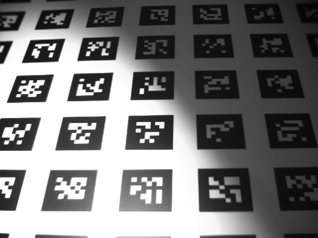
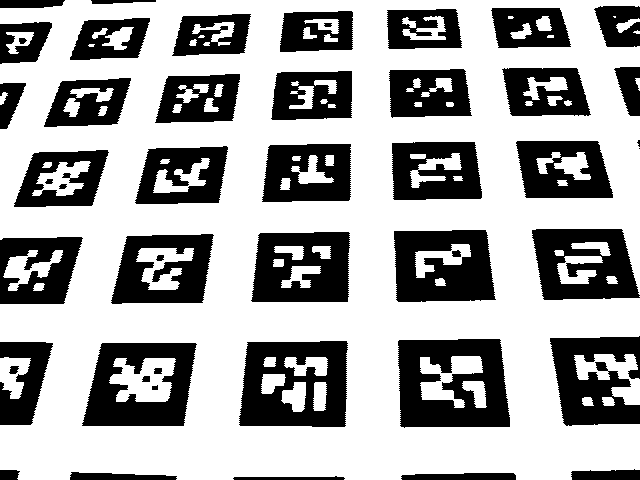

# stbaithreshold

Adaptive Thresholding Using the Integral Image.

Based on https://github.com/rmtheis/bradley-adaptive-thresholding

Use the [stb image library](https://github.com/nothings/stb.git) for processing, you can ignore it.

Build:

```shell
cmake .
make
```

Usage:

```shell
stbaithreshold [options] in.png out.png
options:
  -d NUM    delta local threshold (default 0)
  -e N.N    edgediv factor local threshold (default 0.0)
  -p NUM    count parts (default 8)
  -s N.N    scale factor local threshold (default 0.15)
  -w NUM    window size for edgediv (default 20)
  -h        show this help message and exit
```

Example:

```shell
  stbaithreshold images/image.png images/output.png
```

image.png



output.png


